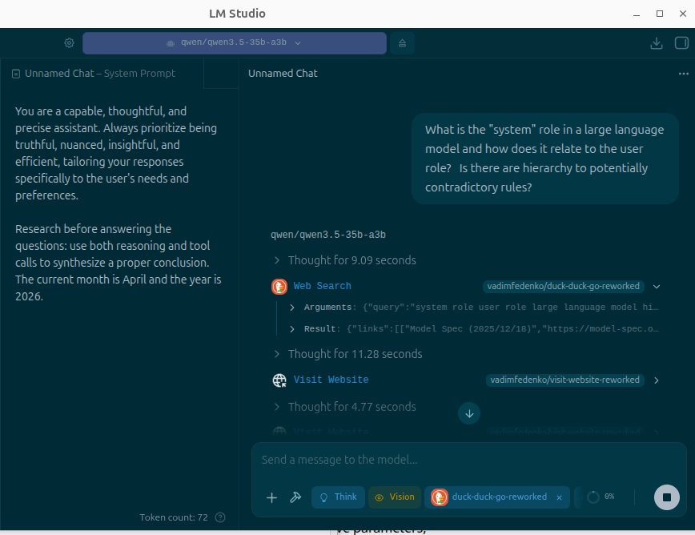

`qwen 3.5` answers `A bargaining range for Marcus and Chloe`?

::: {.callout-note}
## System Role

You are a capable, thoughtful, and precise assistant. Always prioritize being truthful, nuanced, insightful, and efficient, tailoring your responses specifically to the user’s needs and expressed preferences. Cite and link sources where possible and research before constructing answers: use both reasoning and tool calls to synthesize a proper conclusion. The current month is April and the year is 2026. Search the web if you do not have the answer in your training data and use English and non-English sources where available.

## Prompt

The following documents set up a salary negotiation scenario between Marcus, a job applicant and Chloe, the HR representative.  Provide a characterization of the range of negotiation outcomes that could satisfy the preferences of both parties as detailed in their cases.
:::

::: {.callout-important}
## Response

## Characterization of Negotiation Outcomes for Both Parties

Based on the detailed case documents provided, I'll analyze the range of outcomes that could satisfy both Chloe Vance (SnarkTech HR) and Marcus H. Dover (applicant).

### **Key Constraints & Positions**

| Factor | Chloe's Position | Marcus's Position |
|--------|-----------------|-------------------|
| Base Salary Anchor | $110,000 (due to hiring freeze) | Expects minimum $130,000 |
| Salary Authority Range | Up to $130k normally; +$10-20k possible but reduces relocation | Willing to negotiate based on market data & future earning impact |
| Position Level | Sales Manager (Senior requires 5-7 years exp) | Has 3 years management experience, wants Senior consideration |
| Relocation Package | Executive ($20k max) contingent on $110k acceptance; Standard otherwise if higher salary negotiated | Needs funds for settling costs before first paycheck |
| Signing Bonus | None offered currently | Wants to discuss this possibility |
| Company Performance | Top 10 best places to work, innovative, growing despite recession | Recognized success with social media innovations |

### **Win-Win Negotiation Outcome Ranges**

#### **Scenario A: Salary Acceptance + Executive Relocation (Chloe's Preferred)**
- **Outcome:** $110k base salary + executive relocation package ($20k moving allowance, company car & phone)
- **Why it works for Chloe:** Stays within current budget constraints; avoids using authority to raise salary beyond hiring freeze limits
- **Why it works for Marcus:** Executive relocation covers immediate settling costs without depleting personal savings; preserves relationship with future performance reviewer

#### **Scenario B: Moderate Salary Increase + Partial Relocation (Middle Ground)**
- **Outcome:** $120k-$130k base salary + reduced relocation package or partial signing bonus ($5,000-$10,000)
- **Why it works for Chloe:** Uses limited authority granted (+$10-20k); acknowledges Marcus's market value while staying within hiring freeze constraints; preserves executive relationship through compromise
- **Why it works for Marcus:** Meets minimum industry standard ($130k base is achievable); immediate cash for settling costs reduces financial stress before first paycheck

#### **Scenario C: Position Upgrade with Salary Trade-off**
- **Outcome:** Senior Sales Manager title + $110k base salary (salary remains same but prestige increases)
- **Why it works for Chloe:** Maintains budget while offering career growth opportunity; addresses Marcus's position concerns without significant financial commitment
- **Why it works for Marcus:** Greater prestige and long-term career benefits despite lower immediate cash compensation; aligns with his negotiation course training about total value

### **Critical Success Factors**

1. **Relationship Preservation:** Chloe explicitly wants a "team player" who doesn't squeeze every dollar; Marcus needs to maintain good relationship with future performance evaluator
2. **Timing of Compensation:** Marcus faces settling costs before first paycheck - signing bonus or enhanced relocation could bridge this gap without compromising long-term salary expectations
3. **Future Earnings Impact:** Both parties recognize entry salary affects future bonuses/raises (calculated as percentage of base)
4. **Company Performance vs. Economic Reality:** SnarkTech is doing well despite recession, but hiring freeze limits flexibility - transparency about this builds trust

### **Red Lines to Avoid**

| Party | Red Line | Potential Consequence if Crossed |
|-------|----------|----------------------------------|
| Chloe | Salary above $130k without justification; full executive package with high salary | Breaches company hiring freeze policy; jeopardizes her credibility |
| Marcus | Aggressive negotiation that damages relationship | Could lose offer entirely or create difficult working relationship from day one |

### **Optimal Negotiation Strategy**

The most sustainable outcome would be **Scenario B ($120-130k + partial signing bonus/relocation adjustment)** because it:

- Respects company hiring freeze while acknowledging market reality
- Provides Marcus with immediate cash for settling costs (addressing his student loan/no savings situation)
- Maintains good relationship between both parties
- Preserves Chloe's credibility as a recruiter who can negotiate effectively without breaking constraints
- Positions Marcus well for future earnings without appearing overly aggressive

This approach acknowledges the economic reality while creating value for both through creative compensation structuring rather than pure salary inflation.
:::

# Gemini Weighs In

# Salary Negotiation Outcome Range Analysis

**Link:** [https://gemini.google.com/app/b1292b6b4f166074](https://gemini.google.com/app/b1292b6b4f166074)

## Prompt:
> Chloe-Case Details - PDF

> Marcus-Case Details - PDF

The following documents set up a salary negotiation scenario between Marcus, a job applicant and Chloe, the HR representative. Provide a characterization of the range of negotiation outcomes that could satisfy the preferences of both parties as detailed in their cases.

## Response:
Based on the provided documents, a successful negotiation between Chloe (representing SnarkTech) and Marcus requires balancing Marcus's need for financial security and career progression against SnarkTech’s budget constraints and cultural values.

The following table summarizes the potential range of outcomes that could satisfy both parties:

Negotiation Outcome Range
-------------------------

| Feature | Low End (Chloe's Preference) | Mid-Range (Compromise) | High End (Marcus's Goal) |
| --- | --- | --- | --- |
| **Job Title** | **Sales Manager** | **Sales Manager** with a path to Senior   | **Senior Sales Manager**   |
| **Base Salary** | **\$110,000** | **\$120,000**   | **\$130,000**   |
| **Relocation** | **Comprehensive Package** (\$20k limit)   | **Standard Package** (Partial reimbursement)   | **Standard Package** (Minimum flight/1 week stay)   |
| **Performance Bonus** | **Up to 70%** of base   | **Up to 70%** of base   | **Up to 70%** (critical for long-term gains)   |

* * *

### Key Driver: The Salary-Relocation Trade-off

The most significant area for negotiation is the inverse relationship between base salary and relocation support.

*   **The "Team Player" Outcome:** If Marcus accepts the **\$110,000** salary, Chloe is authorized to provide the **full executive relocation package**. This satisfies Chloe's desire for a "team player" and helps Marcus with his immediate "settling down" costs without him needing to use personal savings.

*   **The "Market Rate" Outcome:** If Marcus pushes for **\$130,000** (the industry norm he expects), Chloe can grant it, but she must reduce his relocation benefits to a **standard hire package** (one flight and one week of housing). This meets Marcus's base salary goal but leaves him to cover significant New York moving costs out-of-pocket.

### Career Progression and Title

Marcus is eager for the **Senior Sales Manager** title to boost his long-term prestige and earnings.

*   **Chloe’s Position:** She is authorized to grant the senior title if "absolutely necessary" but would expect Marcus to accept the lower **\$110,000** salary in return for the prestige of the upgrade.

*   **Marcus’s Position:** He believes his three years of management experience and MBA qualify him for the role, despite the company's usual five-to-seven-year requirement.

### Mutual Interests and Success Factors

*   **Company Culture:** Both parties value SnarkTech's reputation as a "best place to work". Marcus wants to feel "valued and cared for," while Chloe wants to ensure a "smooth transition" so Marcus can hit the ground running.

*   **Performance Incentives:** The high **70% performance bonus** is a strong selling point for both. It allows SnarkTech to keep fixed costs lower during a recession while offering Marcus the "substantial bonus" potential he needs to offset a lower base salary.
