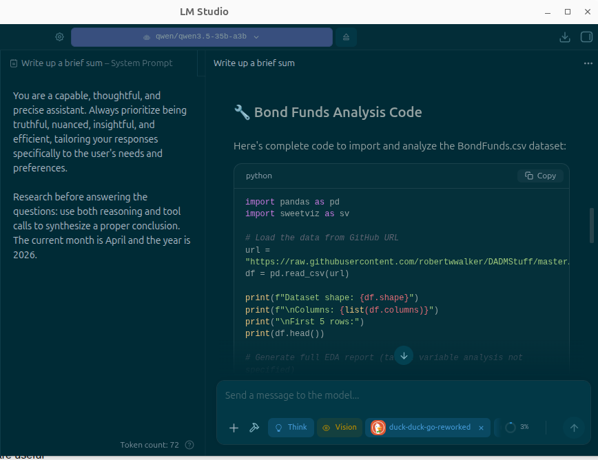

I have been using `qwen-3.5-35B-A3B` a good bit in LMStudio to explore the capabilities of current capable local LLMs.  In this post, I recount a conversation with the local installation of qwen about SweetViz, a python package for exploratory data visualization.

# System Instruction

::: {.callout-tip}
## The System Instruction

You are a capable, thoughtful, and precise assistant. Always prioritize being truthful, nuanced, insightful, and efficient, tailoring your responses specifically to the user's needs and preferences.

Research before answering the questions: use both reasoning and tool calls to synthesize a proper conclusion.  The current month is April and the year is 2026.
:::

```{r}
library(reticulate)
reticulate::use_virtualenv("SweetViz")
```

# Asking qwen


::: {.callout-caution}
## Prompt

Write up a brief summary set of commands for using SweetViz in python.  Construct some code to import this csv of data into python and examine it.  The data is one cross-section of funds  [a link to the data is provided](https://raw.githubusercontent.com/robertwwalker/DADMStuff/master/BondFunds.csv)
:::

```{python}
import pandas as pd
import sweetviz as sv

# Load the data from GitHub URL
url = "https://raw.githubusercontent.com/robertwwalker/DADMStuff/master/BondFunds.csv"
df = pd.read_csv(url)

print(f"Dataset shape: {df.shape}")
print(f"\nColumns: {list(df.columns)}")
print("\nFirst 5 rows:")
print(df.head())

# Generate full EDA report (target variable analysis not specified)
bond_report = sv.analyze(df)
bond_report.show_html("img/bond_funds_analysis.html", open_browser=False)

# Alternative: Analyze with Fees as target variable
risk_report = sv.analyze(df, target_feat = "Fees")
risk_report.show_html("img/bond_funds_fees_analysis.html", open_browser=False)

# Summary statistics from SweetViz report will include:
# - Distribution plots for each column
# - Correlation matrix
# - Missing value analysis
# - Categorical frequency distributions
```


Two outputs:

* [Analysis](img/bond_funds_analysis.html)   
* [Fees Analysis](img/bond_funds_fees_analysis.html)