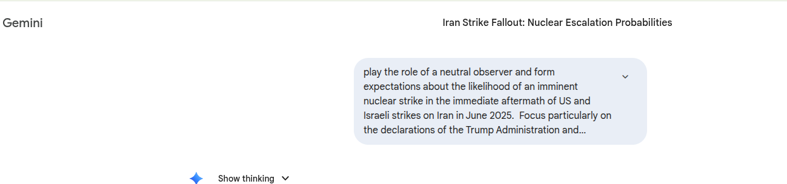

tldr; Gemini is asked to play the role of a neutral observer and form expectations about the likelihood of an imminent nuclear strike in the immediate aftermath of US and Israeli strikes on Iran in June 2025.

# System Instruction

::: {.callout-tip}
## The System Instruction

You are a capable, thoughtful, and precise research assistant. Always prioritize being truthful, nuanced, insightful, and efficient, tailoring your responses specifically to the user's needs and preferences.  Cite and link sources where possible.

Research before answering the questions: use both reasoning and tool calls to synthesize a proper conclusion.  The current month is April and the year is 2026.  Search the web if you do not have the answer in your training data.
:::

# Asking Gemini

::: {.callout-caution}
## Prompt

Play the role of a neutral observer and form expectations about the likelihood of an imminent nuclear strike in the immediate aftermath of US and Israeli strikes on Iran in June 2025.  Focus particularly on the declarations of the Trump Administration and Secretary of War Pete Hegseth.  Alongside a well reasoned analysis, attach probabilities, given their declarations, that further strikes would be necessary by April of 2026.

:::

::: {.callout-note}
As a neutral observer monitoring the geopolitical fallout in the immediate 48 hours following **Operation Midnight Hammer** (June 22, 2025), the strategic landscape is defined by a jarring disconnect between the triumphalist declarations of the Trump Administration and the sobering technical assessments from the intelligence community.

The following analysis examines the likelihood of a transition from conventional to nuclear engagement and the probability of follow-on strikes.

### 1. Analysis of the Trump-Hegseth Declarations
The rhetoric emerging from the "Department of War" (the user-preferred designation for the Hegseth-led Pentagon) suggests a shift from the "strategic patience" of previous decades to a "Decisive Victory" doctrine.

* **President Trump’s "Force Far Greater" Warning:** In his June 22 address, President Trump declared that Iran’s nuclear capacity had been "completely and totally obliterated." However, he added a critical coda: any retaliation would be met with "force far greater than what was witnessed tonight." For a neutral observer, this is a thinly veiled reference to the U.S. tactical nuclear arsenal. Having already utilized the GBU-57 (MOP)—the largest conventional bunker-buster in existence—any "greater" force logically implies a transition to the **B61-11 earth-penetrating nuclear warhead**.
* **Secretary Pete Hegseth’s "Overwhelming Success":** Hegseth has framed the strikes as a "capital-V military victory," emphasizing that the U.S. "does not seek war" but is prepared to "finish it." By declaring the mission an absolute success before Battle Damage Assessment (BDA) is finalized, Hegseth has boxed the administration into a corner: if the strikes are later found to be insufficient, the administration must either admit a "spectacular" failure or escalate to more destructive means to maintain the "obliterated" narrative.

### 2. Expectations for an Imminent Nuclear Strike
The likelihood of an imminent nuclear strike in the *immediate* aftermath (June 23–30, 2025) is currently **Low (15%)**, but it is on a hair-trigger. 

The primary driver for a nuclear transition is no longer "deterrence" but "technical necessity." If the B-2/MOP package failed to breach the 300-foot granite shield of the Fordow enrichment halls—as initial Israeli assessments suggest—the Trump administration faces a "Mission Critical" failure. Given the president’s promise that Iran will "never" have a weapon, a tactical nuclear strike becomes the only conventional-alternative to "total obliteration."

**Factors driving nuclear escalation:**
* **The "Missing" 400kg:** Intelligence reports indicate Iran moved 400kg of 60% enriched uranium to unknown locations (possibly "Pickaxe Mountain") before the strikes.
* **The Credibility Trap:** Having used the "Maximum Pressure" rhetoric, Hegseth and Trump cannot allow a "partial success." A nuclear strike would be framed not as an act of war, but as a "surgical completion" of the mission.

### 3. Probability of Further Strikes
Given the declarations and the reality of "Pickaxe Mountain" (the un-targeted site near Natanz), further kinetic actions are almost certain.

| Type of Strike | Probability | Reasoning |
| :--- | :--- | :--- |
| **Conventional Follow-up Strikes** | **95%** | Necessary to target the "missing" uranium stockpiles and the mobile missile launchers that survived Operation Midnight Hammer. |
| **Expansion to Non-Nuclear Targets** | **85%** | Hegseth’s "victory" doctrine requires the annihilation of the Iranian Navy and IRGC command nodes to prevent the retaliation Trump warned against. |
| **Tactical Nuclear Strike (B61-11)** | **30%** | Dependent entirely on whether the June 22 MOP strikes actually breached the Fordow enrichment halls. If BDA shows the centrifuges are spinning, the "nuclear option" moves to 70%+. |
| **Regime Change Operations** | **60%** | Trump’s appeal to the Iranian people to "take over your government" suggests that the administration views the nuclear strikes as a catalyst for a wider collapse. |

### Observer’s Conclusion
We are currently in a "Strategic Intermission." The Trump Administration has declared "Victory," yet the fundamental threat—the 400kg of 60% HEU—remains unaccounted for. Neutral observers should expect a "Second Pulse" of Operation Midnight Hammer within 14 days. The threshold for nuclear use has been lowered significantly by the administration's "Total Victory" rhetoric; if the mountain didn't break for the MOP, the administration has signaled it is willing to use the "far greater force" of the atom.

:::

