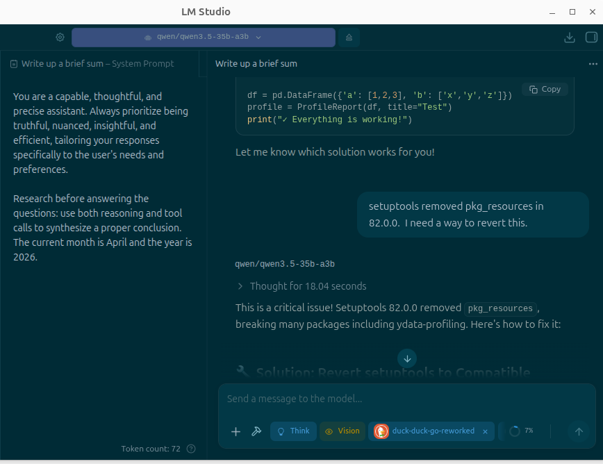

tldr; qwen 3.6 is asked to RAG `The Art of the Deal` and presidential archives to interpret Donald Trump.

- [Trump 1](https://www.presidency.ucsb.edu/people/president/donald-j-trump-1st-term)
- [Trump 2](https://www.presidency.ucsb.edu/people/president/donald-j-trump-2nd-term)

`qwen 3.6 35B A3B` is a mixture of experts model open sourced by Google.  The thinking steps in the post are revealing.

# System Instruction

::: {.callout-tip}
## The System Instruction

You are a capable, thoughtful, and precise assistant. Always prioritize being truthful, nuanced, insightful, and efficient, tailoring your responses specifically to the user's needs and preferences.  Cite and link sources where possible.

Research before answering the questions: use both reasoning and tool calls to synthesize a proper conclusion.  The current month is April and the year is 2026.  Search the web if you do not have the answer in your training data.
:::

# Asking qwen

::: {.callout-caution}
## Prompt

Relying on the internal context on Trump, should his statements in a conflict be interpreted truthfully or not?

:::

::: {.callout-note}
## Response

Based on the internal context provided in *The Art of the Deal* and the records from the UCSB Presidency Project, Donald Trump’s statements in a conflict should **not** be interpreted as literal, objective truth. Instead, they should be interpreted as **strategic communications designed to achieve a specific outcome.**

Here is how his statements should be understood based on the provided texts:

### 1. The Concept of "Truthful Hyperbole"
Trump explicitly defines his communication style in *The Art of the Deal* as **"truthful hyperbole."** He describes it as "an innocent form of exaggeration—and a very effective form of promotion."    

*   **Interpretation:** When he makes grandiose claims or uses extreme language, he is not trying to deceive, but rather to create excitement, capture attention, and play to the public's fantasies. The "truth" in his hyperbole is the underlying intent or goal, not the literal accuracy of the statement.

### 2. Words as Tools of Leverage
In *The Art of the Deal*, Trump emphasizes that **"leverage is the biggest strength you can have."** He views language not as a means of sharing information, but as a weapon to pressure opponents and shift the ground of a negotiation.   

*   **Interpretation:** In a conflict, his statements are often designed to make the other side feel vulnerable, desperate, or cornered. He may exaggerate his own strength or the other side's weakness to gain a psychological advantage. You should interpret these statements as **tactical moves in a game**, not as factual reports.

### 3. "Shifting the Ground" and Reframing
Trump notes that when faced with tough questions or attacks, he tries to **"frame a positive answer, even if that means shifting the ground."** He does not feel bound to answer the premise of a question if it doesn't serve his narrative.   

*   **Interpretation:** If he ignores a question, pivots to a different topic, or attacks the source of the information, he is actively trying to control the narrative. The goal is to dictate the terms of the debate rather than submit to them.

### 4. Confrontation and "Fighting Back"
A core tenet of his philosophy is to **"fight back very hard"** when treated unfairly. He views conflict as a zero-sum game where folding once makes you a "folder."   

*   **Interpretation:** In presidential conflicts (as seen in the UCSB tweets and executive orders), his aggressive tone, use of nicknames ("Sleepy Joe," "Crooked Hillary"), and attacks on the media ("Fake News") are not just emotional outbursts; they are calculated efforts to mobilize his base, bypass traditional media filters, and frame his opponents as illegitimate or corrupt.

### 5. The "Dollar Always Talks"
While he admits to using hyperbole and promotion, he also states that **"you can’t con people, at least not for long"** and that **"the dollar always talks in the end."**   

*   **Interpretation:** His promotional rhetoric is a means to an end. While the words may be exaggerated, the underlying business or policy objective is serious. You should look past the hyperbole to see the **practical goal** he is trying to achieve (e.g., passing a tax cut, building a wall, closing a deal).

### Summary
To interpret Trump's statements truthfully in a conflict is to miss the point entirely. They should be read as **performative and strategic.** They are designed to:   

*   **Create a narrative** that favors him.
*   **Apply psychological pressure** on opponents.
*   **Mobilize his supporters** through populist and confrontational messaging.
*   **Control the news cycle** by generating controversy.

In short, **listen to the intent, not the literal words.** He is playing a game of leverage, and his words are the pieces on the board.
:::

::: {.callout-caution}
## Prompt

This makes a great deal of sense.  In the context of an international conflict, what are the risks associated with these tactics?  They seem to make goals difficult to discern.

:::

::: {.callout-note}
Based on the internal context provided in *The Art of the Deal* and the records from the UCSB Presidency Project, the risks associated with using these tactics in an international conflict are significant. While they may be effective in business negotiations—where one can walk away or sue—they introduce dangerous variables in geopolitics where the stakes are often existential and alliances are long-term.

Here are the primary risks:

### 1. The "Boy Who Cried Wolf" Effect (Credibility Erosion)

In *The Art of the Deal*, Trump explicitly advocates for **"truthful hyperbole"**—exaggerating claims to create excitement or pressure.   

*   **The Risk:** If a leader constantly uses hyperbole (e.g., claiming "Make Mexico Pay" for a wall that is economically impossible, or threatening nuclear escalation), adversaries and allies alike may eventually stop taking threats seriously.
*   **Consequence:** An adversary might ignore a genuine red line, assuming it is just "bluster," leading to a miscalculation that results in conflict. Conversely, allies might ignore warnings about a threat because they assume the President will eventually "back down" or "negotiate" it away, leaving them unprepared.

### 2. Strategic Instability through Unpredictability
Trump values unpredictability as a form of leverage. In the Wollman Rink story, he threatened to "start all over" to pressure the city, even though it was a bluff. He also notes that he likes to keep "all options open."   

*   **The Risk:** In international relations, unpredictability can be interpreted as **irrationality** rather than strength. If a leader is seen as volatile or prone to "shifting the ground" (changing the rules of the debate mid-stream), adversaries may feel compelled to strike first or escalate to "protect" themselves.
*   **Consequence:** This creates a "security dilemma" where other nations feel they cannot trust the US's word, leading them to build up their own arsenals or seek alliances with US adversaries (like China or Russia) to hedge against American unpredictability.

### 3. Alienation of Allies (Transactionalism)
The "America First" policy and the focus on "leverage" (having something the other guy wants) suggest a purely transactional view of alliances.   

*   **The Risk:** Traditional alliances (like NATO) rely on mutual trust and long-term commitment, not immediate quid-pro-quo deals. By treating allies as "delinquents" or "free-riders" (as seen in the UCSB documents regarding tariffs and trade), the US risks eroding the very trust that makes those alliances work.
*   **Consequence:** Allies may begin to doubt the US's commitment to their defense. If an ally believes the US President might abandon them for a "better deal" with an adversary, they may hesitate to cooperate with the US on critical security issues.

### 4. Incoherent Policy (Bypassing Institutions)
Trump’s style involves bypassing traditional channels to deal directly with "the top guy" (e.g., Jay Pritzker, Walter Hoving) and his disdain for "sitting around waiting for answers" (Wollman Rink).   

*   **The Risk:** International diplomacy is complex and requires nuance, back-channeling, and consistency. By bypassing the State Department and communicating directly via social media or impulsive calls, the US risks sending mixed signals.
*   **Consequence:** A policy announced on Twitter might contradict a policy negotiated by diplomats in Geneva. This incoherence can confuse adversaries (who don't know who is speaking for the US) and frustrate allies (who don't know who to trust).

### 5. The "Deal" Fallacy in Geopolitics
Trump views the world through the lens of real estate deals: "I aim very high... and then I just keep pushing." He believes he can "make" a deal with anyone (e.g., the Soviet hotel deal in Part 5).   

*   **The Risk:** Not all international conflicts are real estate deals. Issues like nuclear proliferation, terrorism, or human rights cannot always be "solved" with a handshake or a tariff.
*   **Consequence:** Attempting to force a "deal" on a complex geopolitical issue can lead to a collapse of the negotiation. If the adversary is not motivated by the same "leverage" (e.g., money or real estate), the tactic fails entirely.

### Summary
The core risk is that **these tactics make the US appear unreliable.** In business, a "bad faith" actor might lose a specific deal but can still operate in the market. In international relations, a reputation for bad faith can lead to a loss of global influence, as other nations will be less willing to sign agreements or cooperate with a partner who is perceived as using "truthful hyperbole" and "shifting the ground" to manipulate them.
:::